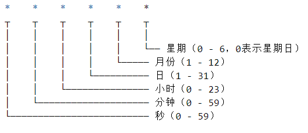

## 原生 JS

## Node

##### 大文件上传： 

大文件的切片上传，nodejs的path + file对文件进行操作，express + multer + cors 写网络部分，html + js--fetch 去上传并请求。
通过promse.all来控制所有的网络请求，都lock-in;

##### Net模块：
在传输层基于TCP去读取和发送,而不用上升到HTTP去

##### 定时任务：
通过node-schedule实现，主要就是corn表达式去设置具体的执行时机

